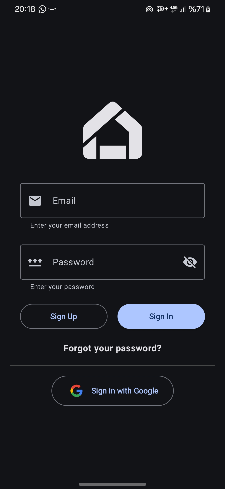
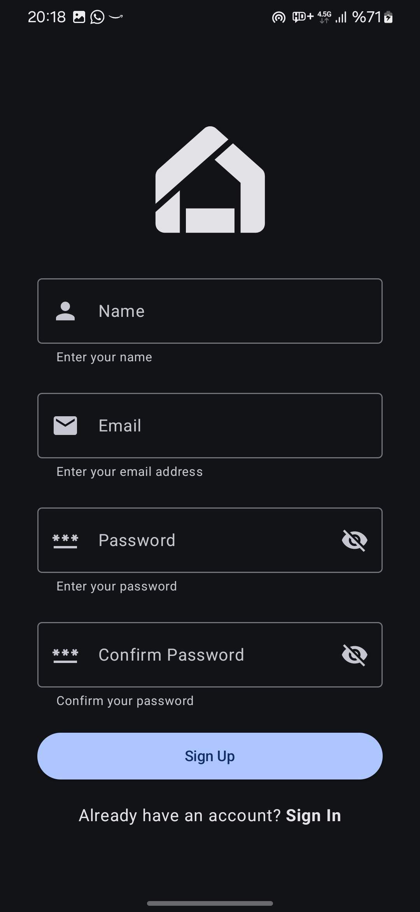
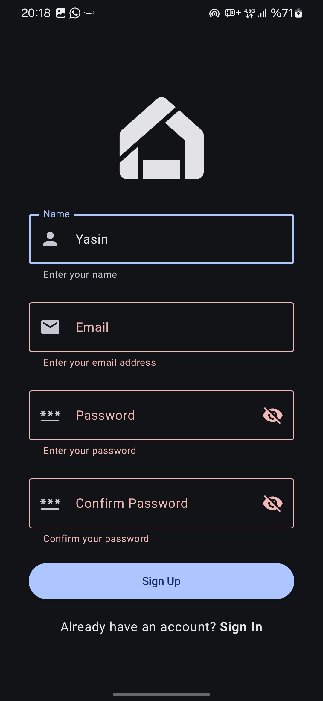
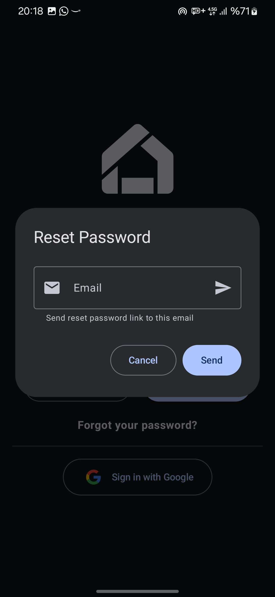
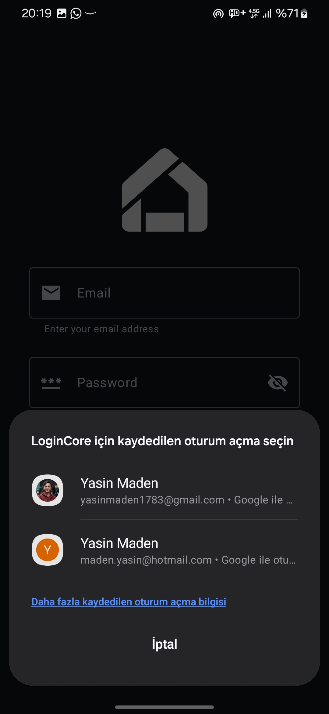
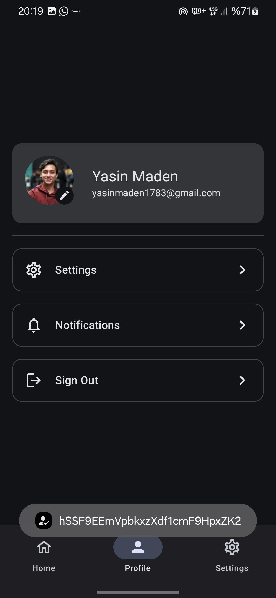
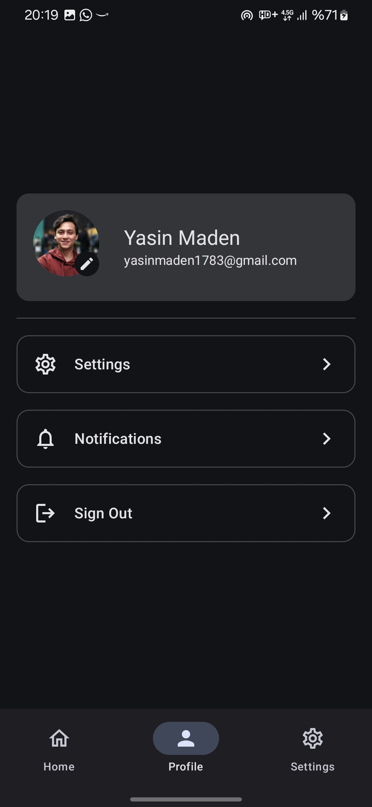
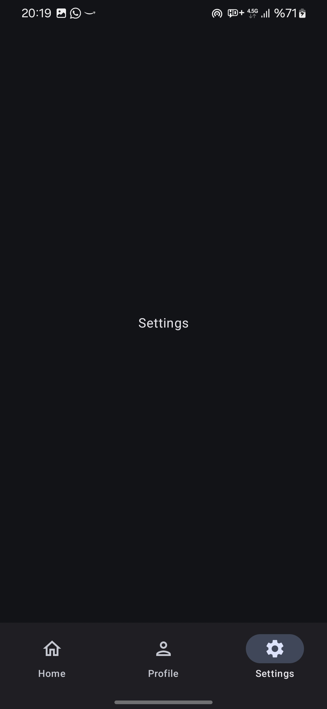
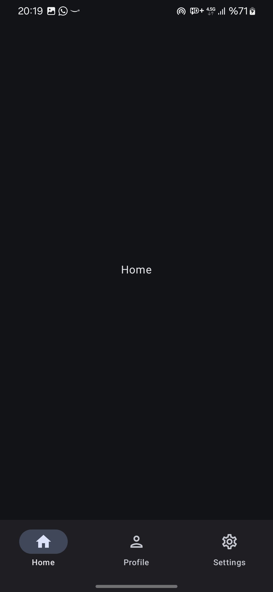

# Login Template with Kotlin and Jetpack Compose

This project is a reusable template for login functionality in Android apps. It uses modern technologies like Jetpack Compose, MVI architecture, Hilt for dependency injection, and Firebase Authentication. With this template, you can quickly start new Android projects without writing login code again.

## Features

- **Jetpack Compose**: A modern UI framework.
- **MVI Architecture**: Provides predictable state management.
- **Hilt**: Makes dependency injection easy.
- **Firebase Authentication**: Supports email/password and Google sign-in.
- **Clean and Modular Code**: Easy to update and extend.
- **Post-Login Navigation**: After login, users see a bottom navigation bar with Home, Profile, and Settings screens.

## Getting Started

### Setup

1. **Clone the repository**:

   ```bash
   git clone https://github.com/madenyasin/LoginCore/
   cd LoginCore
   ```

2. **Connect to Firebase**:

   - Add the `google-services.json` file to the `app/` directory.
   - Turn on Email/Password and Google sign-in in the Firebase console.

3. **Update `strings.xml`**:

   - Go to `res/values/strings.xml`.
   - Add your `WEB_CLIENT_ID` from Firebase:
     ```xml
     <string name="WEB_CLIENT_ID">YOUR_WEB_CLIENT_ID</string>
     ```

4. **Build and Run**:

   - Open the project in Android Studio.
   - Sync the Gradle files.
   - Run the app on a device or emulator.

### Project Structure

```
│   MainApp.kt
│   
├───common
│       Constants.kt
│       Resource.kt
│       
├───data
│   ├───mapper
│   │       UserMapper.kt
│   │       
│   ├───model
│   │       UserEntity.kt
│   │       
│   └───repository
│           AuthRepositoryImpl.kt
│           UserRepositoryImpl.kt
│           
├───di
│       CredentialManagerModule.kt
│       FirebaseModule.kt
│       GoogleSignInHelperModule.kt
│       RepositoryModule.kt
│       SupabaseModule.kt
│       UseCaseModule.kt
│
├───domain
│   ├───model
│   │       User.kt
│   │
│   └───repository
│           AuthRepository.kt
│           UserRepository.kt
│
├───presentation
│   │   MainActivity.kt
│   │
│   ├───auth
│   │   ├───components
│   │   │   ├───buttons
│   │   │   │       SignInButtonSection.kt
│   │   │   │       SignupButtonSection.kt
│   │   │   │
│   │   │   ├───others
│   │   │   │       AppLogo.kt
│   │   │   │       ResetPasswordDialog.kt
│   │   │   │
│   │   │   ├───textfields
│   │   │   │       SignInEmailField.kt
│   │   │   │       SignInPasswordField.kt
│   │   │   │       SignupConfirmPasswordField.kt
│   │   │   │       SignupEmailField.kt
│   │   │   │       SignupNameField.kt
│   │   │   │       SignupPasswordField.kt
│   │   │   │
│   │   │   └───texts
│   │   │           SignInForgotPasswordText.kt
│   │   │           SignupHaveAnAccountText.kt
│   │   │
│   │   ├───signin
│   │   │       SignInContract.kt
│   │   │       SignInScreen.kt
│   │   │       SignInViewModel.kt
│   │   │
│   │   └───signup
│   │           SignUpContract.kt
│   │           SignUpScreen.kt
│   │           SignUpViewModel.kt
│   │
│   ├───global
│   │       AuthStateViewModel.kt
│   │       ObserveAuthStateUseCase.kt
│   │
│   ├───main
│   │   ├───components
│   │   │       NavBar.kt
│   │   │       NavBarItems.kt
│   │   │
│   │   ├───home
│   │   │       HomeContract.kt
│   │   │       HomeScreen.kt
│   │   │       HomeViewModel.kt
│   │   │
│   │   ├───profile
│   │   │       ProfileContract.kt
│   │   │       ProfileScreen.kt
│   │   │       ProfileViewModel.kt
│   │   │
│   │   └───settings
│   │           SettingsContract.kt
│   │           SettingsScreen.kt
│   │           SettingsViewModel.kt
│   │
│   └───navigation
│           AppNavGraph.kt
│           Screen.kt
│
├───theme
│       Color.kt
│       Theme.kt
│       Type.kt
│
└───utils
        GoogleSignInHelper.kt

```

### Key Technologies

- **Kotlin**: The language for Android development.
- **Jetpack Compose**: For building UIs.
- **Hilt**: For dependency injection.
- **Firebase**: For authentication services.

## Usage

This template is flexible and can be expanded. To customize:

1. Update Firebase settings in the `google-services.json` file.
2. Add or change screens in the `presentation/` folder.
3. Add new business logic in the `domain/` folder.

### Post-Login Navigation

Once users log in, the app shows a bottom navigation bar with these screens:

- **Home**: Placeholder screen for future use.
- **Profile**: Placeholder screen for user details.
- **Settings**: Placeholder screen for app settings.

These screens are simple and ready for further development.

## Screenshots

 






